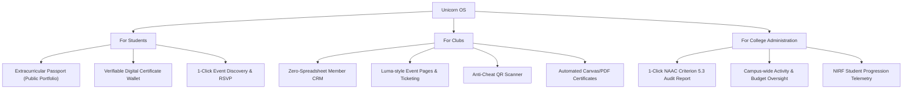

# Unicorn OS: The Operating System for Campus Life & Student Extracurricular Identity

> **Executive Summary:**  
> Unicorn OS is a multi-tenant B2B2C SaaS platform that replaces the fragmented stack of Google Forms, Sheets, WhatsApp groups, Canva, Drive, and paper sign-in sheets used by university clubs.  
> While club executives love it for 1-click event ticketing, anti-proxy QR attendance, and auto-generated verifiable certificates, **the ultimate enterprise monetization engine targets College Principals and Deans by automating NAAC / NIRF accreditation reporting (Criterion 5: Student Participation & Activities).**

---

## 1. Brand Identity & Strategic Positioning



### The Pitch
- **Category:** HigherEd Extracurricular Management & Verified Student Credentialing.
- **Tagline:** *"The Operating System for Campus Life."*
- **The Core Problem:** Every semester, 50+ college clubs spend 1,000+ collective hours running a fragile duct-tape pipeline:
  $$\text{Instagram} \longrightarrow \text{Google Form} \longrightarrow \text{Google Sheet} \longrightarrow \text{WhatsApp Spam} \longrightarrow \text{Paper Attendance} \longrightarrow \text{Canva Batch} \longrightarrow \text{Gmail}$$
- **The Enterprise Hook (Why Colleges Pay):**  
  Accreditation bodies (NAAC in India, ABET/AACSB internationally, NIRF rankings) mandate rigorous proof of student extracurricular participation, workshops organized, attendance records, and certificates issued. Today, college faculty waste 3 weeks before inspections frantically begging students for photos and spreadsheets. **Unicorn OS generates compliance reports in 1 click.**

---

## 2. System Architecture & Multi-Tenancy

Unicorn OS implements a hierarchical multi-tenant structure:

```
Institution (e.g., Pune Institute of Computer Technology)
  ├── Departments (CS, IT, ENTC, Mech, Civil)
  ├── Faculty Council / IQAC Dean
  └── Clubs / Student Chapters (IEEE, ACM, Robotics, CESA, Literary, Drama)
        ├── Leadership / Core Team (President, Secretary, Leads)
        ├── Volunteers / Organizers (Scanner access)
        ├── Events (Hackathons, Workshops, Webinars, Cultural Fests)
        │     ├── Registrations / Tickets (Unique QR Tokens)
        │     ├── Attendance Logs (Timestamped, Geofenced/TOTP)
        │     └── Issued Certificates (Unique Hash, Public Verification Link)
        └── Members & Recruitment
```

### Role-Based Access Control (RBAC) Matrix

| Capability | Student | Club Volunteer | Club Executive / Lead | Faculty Advisor | College Dean / IQAC |
| :--- | :---: | :---: | :---: | :---: | :---: |
| Discover Events & RSVP | ✅ | ✅ | ✅ | ✅ | ✅ |
| Scan Attendee QRs at Door | ❌ | ✅ | ✅ | ❌ | ❌ |
| Create Events & Publish Pages | ❌ | ❌ | ✅ | ❌ | ❌ |
| Issue Certificates & Customize Templates | ❌ | ❌ | ✅ | ❌ | ❌ |
| Manage Recruitment & Shortlisting | ❌ | ❌ | ✅ | ❌ | ❌ |
| Approve Club Events / Budget / Venues | ❌ | ❌ | ❌ | ✅ | ✅ |
| Export NAAC/NIRF Campus Reports | ❌ | ❌ | ❌ | ❌ | ✅ |
| Personal Verified Portfolio (`/@username`) | ✅ | ✅ | ✅ | ❌ | ❌ |

---

## 3. Production-Ready PostgreSQL Database Schema

```sql
-- 1. ENUMS
CREATE TYPE user_role AS ENUM ('STUDENT', 'CLUB_VOLUNTEER', 'CLUB_ADMIN', 'FACULTY_ADVISOR', 'COLLEGE_ADMIN', 'SUPERADMIN');
CREATE TYPE event_status AS ENUM ('DRAFT', 'PENDING_APPROVAL', 'PUBLISHED', 'ONGOING', 'COMPLETED', 'CANCELLED');
CREATE TYPE registration_status AS ENUM ('REGISTERED', 'CHECKED_IN', 'CANCELLED', 'WAITLISTED');
CREATE TYPE recruitment_status AS ENUM ('APPLIED', 'SHORTLISTED', 'INTERVIEW_SCHEDULED', 'ACCEPTED', 'REJECTED');

-- 2. INSTITUTIONS (Colleges / Universities)
CREATE TABLE institutions (
    id UUID PRIMARY KEY DEFAULT gen_random_uuid(),
    name VARCHAR(255) NOT NULL,
    slug VARCHAR(100) UNIQUE NOT NULL, -- e.g. "pict-pune"
    domain VARCHAR(100), -- e.g. "pict.edu" for email domain whitelisting
    logo_url TEXT,
    location VARCHAR(255),
    naac_accreditation_cycle VARCHAR(50),
    created_at TIMESTAMPTZ DEFAULT NOW(),
    updated_at TIMESTAMPTZ DEFAULT NOW()
);

-- 3. USERS & PROFILES
CREATE TABLE profiles (
    id UUID PRIMARY KEY REFERENCES auth.users(id) ON DELETE CASCADE,
    institution_id UUID REFERENCES institutions(id) ON DELETE SET NULL,
    full_name VARCHAR(150) NOT NULL,
    username VARCHAR(60) UNIQUE NOT NULL, -- e.g. "aditi.bhor" for public portfolio
    email VARCHAR(255) UNIQUE NOT NULL,
    phone VARCHAR(20),
    prn_or_roll_no VARCHAR(50),
    department VARCHAR(100), -- e.g. "Computer Engineering"
    graduation_year INT,     -- e.g. 2027
    division VARCHAR(10),    -- e.g. "E"
    avatar_url TEXT,
    bio TEXT,
    linkedin_url TEXT,
    github_url TEXT,
    volunteer_hours_logged NUMERIC(6, 2) DEFAULT 0.00,
    created_at TIMESTAMPTZ DEFAULT NOW(),
    updated_at TIMESTAMPTZ DEFAULT NOW()
);

-- 4. CLUBS & CHAPTERS
CREATE TABLE clubs (
    id UUID PRIMARY KEY DEFAULT gen_random_uuid(),
    institution_id UUID REFERENCES institutions(id) ON DELETE CASCADE,
    name VARCHAR(150) NOT NULL,
    slug VARCHAR(100) NOT NULL,
    category VARCHAR(50) NOT NULL, -- Technical, Cultural, Sports, Social, Literary
    logo_url TEXT,
    banner_url TEXT,
    description TEXT,
    instagram_handle VARCHAR(100),
    linkedin_url TEXT,
    faculty_advisor_id UUID REFERENCES profiles(id),
    is_verified BOOLEAN DEFAULT TRUE,
    created_at TIMESTAMPTZ DEFAULT NOW(),
    UNIQUE(institution_id, slug)
);

-- 5. CLUB MEMBERSHIPS & ROLES
CREATE TABLE club_members (
    id UUID PRIMARY KEY DEFAULT gen_random_uuid(),
    club_id UUID REFERENCES clubs(id) ON DELETE CASCADE,
    user_id UUID REFERENCES profiles(id) ON DELETE CASCADE,
    team_name VARCHAR(100), -- "Network Team", "Technical", "Design", "Sponsorship"
    designation VARCHAR(100) NOT NULL, -- "President", "Lead", "Coordinator", "Member"
    role user_role DEFAULT 'STUDENT',
    joined_at DATE DEFAULT CURRENT_DATE,
    tenure_year VARCHAR(20), -- "2026-27"
    is_active BOOLEAN DEFAULT TRUE,
    created_at TIMESTAMPTZ DEFAULT NOW(),
    UNIQUE(club_id, user_id, tenure_year)
);

-- 6. EVENTS
CREATE TABLE events (
    id UUID PRIMARY KEY DEFAULT gen_random_uuid(),
    club_id UUID REFERENCES clubs(id) ON DELETE CASCADE,
    institution_id UUID REFERENCES institutions(id) ON DELETE CASCADE,
    title VARCHAR(255) NOT NULL,
    slug VARCHAR(150) NOT NULL,
    description TEXT,
    banner_url TEXT,
    venue VARCHAR(255) NOT NULL, -- "Seminar Hall 2" or "Google Meet"
    is_online BOOLEAN DEFAULT FALSE,
    meeting_link TEXT,
    start_time TIMESTAMPTZ NOT NULL,
    end_time TIMESTAMPTZ NOT NULL,
    registration_deadline TIMESTAMPTZ NOT NULL,
    max_capacity INT DEFAULT 100,
    current_registrations INT DEFAULT 0,
    entry_fee NUMERIC(8, 2) DEFAULT 0.00,
    eligibility_departments TEXT[], -- NULL means open to all departments
    eligibility_years INT[],        -- e.g. ARRAY[1, 2, 3, 4]
    status event_status DEFAULT 'PUBLISHED',
    faculty_approved BOOLEAN DEFAULT TRUE,
    certificate_enabled BOOLEAN DEFAULT TRUE,
    created_at TIMESTAMPTZ DEFAULT NOW(),
    UNIQUE(club_id, slug)
);

-- 7. EVENT REGISTRATIONS & TICKET TOKENS
CREATE TABLE event_registrations (
    id UUID PRIMARY KEY DEFAULT gen_random_uuid(),
    event_id UUID REFERENCES events(id) ON DELETE CASCADE,
    user_id UUID REFERENCES profiles(id) ON DELETE CASCADE,
    ticket_token VARCHAR(64) UNIQUE NOT NULL, -- Nonce for QR validation
    status registration_status DEFAULT 'REGISTERED',
    custom_answers JSONB, -- Dynamic form fields if the club requested extra info
    registered_at TIMESTAMPTZ DEFAULT NOW(),
    UNIQUE(event_id, user_id)
);

-- 8. ATTENDANCE LOGS
CREATE TABLE event_attendance (
    id UUID PRIMARY KEY DEFAULT gen_random_uuid(),
    registration_id UUID REFERENCES event_registrations(id) ON DELETE CASCADE,
    event_id UUID REFERENCES events(id) ON DELETE CASCADE,
    user_id UUID REFERENCES profiles(id) ON DELETE CASCADE,
    checked_in_at TIMESTAMPTZ DEFAULT NOW(),
    checked_in_by UUID REFERENCES profiles(id), -- Volunteer who scanned
    check_in_method VARCHAR(20) DEFAULT 'QR_SCAN', -- 'QR_SCAN', 'MANUAL_OVERRIDE'
    ip_address INET,
    UNIQUE(event_id, user_id)
);

-- 9. CERTIFICATE TEMPLATES
CREATE TABLE certificate_templates (
    id UUID PRIMARY KEY DEFAULT gen_random_uuid(),
    club_id UUID REFERENCES clubs(id) ON DELETE CASCADE,
    title VARCHAR(150) NOT NULL, -- e.g. "Standard Workshop Template"
    background_svg_or_image TEXT NOT NULL,
    template_config JSONB NOT NULL, 
    -- Contains coordinates & styling for: {{student_name}}, {{event_name}}, {{date}}, {{qr_code}}, {{signer_signature}}
    is_default BOOLEAN DEFAULT FALSE,
    created_at TIMESTAMPTZ DEFAULT NOW()
);

-- 10. ISSUED CERTIFICATES & VERIFICATION REPOSITORY
CREATE TABLE issued_certificates (
    id UUID PRIMARY KEY DEFAULT gen_random_uuid(),
    certificate_number VARCHAR(50) UNIQUE NOT NULL, -- e.g. "UNI-2026-AIW-0084"
    verification_hash VARCHAR(64) UNIQUE NOT NULL,  -- SHA256 cryptographic check
    event_id UUID REFERENCES events(id) ON DELETE CASCADE,
    user_id UUID REFERENCES profiles(id) ON DELETE CASCADE,
    club_id UUID REFERENCES clubs(id) ON DELETE CASCADE,
    student_name VARCHAR(150) NOT NULL,
    event_title VARCHAR(255) NOT NULL,
    issue_date DATE DEFAULT CURRENT_DATE,
    pdf_url TEXT,
    metadata JSONB,
    created_at TIMESTAMPTZ DEFAULT NOW(),
    UNIQUE(event_id, user_id)
);

-- 11. CLUB RECRUITMENT CYCLES & APPLICATIONS
CREATE TABLE recruitment_cycles (
    id UUID PRIMARY KEY DEFAULT gen_random_uuid(),
    club_id UUID REFERENCES clubs(id) ON DELETE CASCADE,
    title VARCHAR(150) NOT NULL, -- e.g. "SARC Core Recruitment 2026-27"
    is_open BOOLEAN DEFAULT TRUE,
    deadline TIMESTAMPTZ NOT NULL,
    departments_eligible TEXT[],
    created_at TIMESTAMPTZ DEFAULT NOW()
);

CREATE TABLE recruitment_applications (
    id UUID PRIMARY KEY DEFAULT gen_random_uuid(),
    cycle_id UUID REFERENCES recruitment_cycles(id) ON DELETE CASCADE,
    user_id UUID REFERENCES profiles(id) ON DELETE CASCADE,
    target_team VARCHAR(100) NOT NULL, -- "Network Team", "Content", "Web Dev"
    answers JSONB NOT NULL,
    resume_url TEXT,
    status recruitment_status DEFAULT 'APPLIED',
    interviewer_notes TEXT,
    submitted_at TIMESTAMPTZ DEFAULT NOW(),
    UNIQUE(cycle_id, user_id)
);
```

---

## 4. Deep-Dive: The Core Technical Engines

### A. Anti-Cheat QR Attendance Architecture
**The Flaw in basic QR setups:** If an organizer projects a static QR code on the screen, a student snaps a photo and posts it in their WhatsApp group. 50 students in dorms scan it from their beds ("proxy attendance").

**Unicorn OS Dual-Mode Anti-Cheat:**
1. **Mode 1: Luma-Style Attendee Ticket QR (Recommended for Workshops & Capacity Events)**
   - Every registered student gets a unique, tamper-proof `ticket_token` QR on their phone screen.
   - Club organizers/volunteers simply open `unicorn.ac/scan` on any phone browser (using Camera API / `html5-qrcode`).
   - Organizer scans the student's phone at the door $\rightarrow$ Instant sound beep + Green screen with student photo & department $\rightarrow$ Marked Present $\rightarrow$ Eliminates 100% of proxy attendance.
2. **Mode 2: Dynamic Projector Screen QR with Rotating TOTP (For 500+ Auditorium Talks)**
   - If mass self-check-in is necessary, the projector screen shows a QR code generated with a rotating TOTP (Time-Based One-Time Password) that **refreshes every 10 seconds** via WebSockets.
   - A forwarded screenshot expires within 10 seconds, rendering off-campus scans invalid.
   - Optional browser Geofencing verification (must be within 200m of the Seminar Hall coordinates).

### B. Dynamic Certificate Studio & Public Verification
1. **Template Engine:**
   - Visual drag-and-drop designer rendering on HTML5 Canvas / SVG.
   - Dynamic placeholders: `{{name}}`, `{{event}}`, `{{date}}`, `{{role}}`, `{{cert_id}}`, `{{qr_verification_url}}`.
2. **Automated Batch Pipeline:**
   - Once the event coordinator clicks **"End Event & Issue Certificates"**, the system filters all students with `attendance = 'CHECKED_IN'`.
   - Generates vector-crisp PDF certificates via `@react-pdf/renderer` or serverless Puppeteer.
   - Files are stored in Supabase Storage with cryptographic SHA-256 hash.
3. **Public Verification Link (`unicorn.ac/verify/[hash]`):**
   - Anyone (recruiters, grad school admissions, college deans) can scan the QR on the certificate or visit the URL.
   - Displays:
     - ✅ Official Institution Seal
     - ✅ Issuing Club Name & Faculty Signatures
     - ✅ Student Name, Event Title, Date & Scope of Workshop
     - 💼 One-click **"Add to LinkedIn Licenses & Certifications"** button (pre-filled LinkedIn API parameters).

### C. Personal Extracurricular Passport (`unicorn.ac/@username`)
Every student receives a portable, publicly shareable portfolio:
- **Verified Extracurricular Timeline:** Chronological log of events attended, hackathons won, and roles held.
- **Leadership Transcript:** e.g., "Co-Organizer — AI Workshop 2026", "Lead — Network Team 2026-27".
- **Downloadable Extracurricular Transcript (PDF):** A clean, verified 1-page document with an institutional QR seal that students attach to their resumes for corporate campus placements and foreign university admissions.

### D. The NAAC / NIRF Institutional Compliance Engine (The Revenue Moat)
In India and global institutions, accreditation teams spend weeks compiling **NAAC Criterion 5.3**:
- *Metric 5.3.2:* Number of sports and cultural programs in which students participated during the year.
- *Metric 5.3.3:* Average number of sports and cultural events/competitions organized by the institution.
- *Criterion 6:* Faculty and student capability development programs.

**Unicorn OS 1-Click NAAC Export:**
- Generates pre-formatted Excel and PDF reports matching exact NAAC data template specifications:
  - Event Name, Date, Category (Technical, Cultural, Sports, Life Skills)
  - Number of participants with Department-wise & Gender-wise breakdowns
  - Direct links to timestamped attendance sheets, geotagged event photos, and issued certificates
- **Result:** Turns 200 hours of chaotic faculty paperwork into a 10-second export.

---

## 5. Screen-by-Screen Information Architecture & UI

```
┌────────────────────────────────────────────────────────────────────────┐
│                              UNICORN OS                                │
│                   The Campus Life Operating System                     │
├────────────────────────────────────────────────────────────────────────┤
│ 1. Public Portals:                                                     │
│    ├── /                            (Landing page & campus discovery)  │
│    ├── /[college-slug]              (College hub: All clubs & events)  │
│    ├── /[college]/events/[slug]     (Luma-style event registration)    │
│    ├── /verify/[cert_hash]          (Public verification portal)       │
│    └── /@[username]                 (Student Extracurricular Passport) │
│                                                                        │
│ 2. Student Portal:                                                     │
│    ├── /dashboard                   (My upcoming events, applications) │
│    ├── /tickets                     (My QR entry passes for events)    │
│    └── /wallet                      (My certificates & achievement log)│
│                                                                        │
│ 3. Club Command Center (Admins/Execs):                                 │
│    ├── /[club]/overview             (Club health, active members)      │
│    ├── /[club]/events/new           (Create & publish event)           │
│    ├── /[club]/events/[id]/scanner  (Mobile QR scanner for doors)      │
│    ├── /[club]/certificates         (Canvas template studio & issuance)│
│    ├── /[club]/recruitment          (Kanban applicant shortlisting)    │
│    └── /[club]/analytics            (Retention, attendance %)          │
│                                                                        │
│ 4. Institution Super-Admin (Deans / IQAC):                            │
│    ├── /admin/overview              (Campus-wide activity metrics)     │
│    ├── /admin/approvals             (Event & budget sign-offs)         │
│    └── /admin/naac-reports          (1-Click accreditation PDF/Excel)  │
└────────────────────────────────────────────────────────────────────────┘
```

---

## 6. Go-To-Market Playbook: From 0 to 50 Colleges

### Phase 1: The "Trojan Horse" Event (Day 1 - 30)
- **Target:** 1 flagship technical or cultural club at your own college (e.g., IEEE Student Branch, Coding Club, or E-Cell).
- **The Offer:** *"We will manage your upcoming 2-day flagship hackathon/workshop completely for free. No more Google Forms, zero proxy attendance, and every attendee gets an automated verifiable certificate."*
- **Outcome:** 
  - 300 to 500 students register through Unicorn OS.
  - 500 students now have an active Unicorn profile and certificate wallet.
  - Core team of that club becomes your product evangelists.

### Phase 2: Campus Virality & Cross-Club Expansion (Day 31 - 60)
- Every student who gets a certificate shares it on LinkedIn and Instagram stories (`tagging #UnicornOS`).
- Other club leaders (CESA, Robotics, Literary, Sports) see the slick event pages and verifiable certificates.
- Offer self-serve club onboarding: *"First 3 events and 100 members free forever."*
- Within 60 days, 15+ clubs on your campus are running on Unicorn OS.

### Phase 3: The Dean / Principal Enterprise Close (Day 61 - 90)
- You don't pitch the Principal on "helping clubs communicate."
- **You pitch the IQAC Coordinator / Dean of Student Affairs on NAAC compliance:**
  > *"Respected Sir/Madam, this semester your student clubs organized 38 events with 3,400 participations. Right now, your faculty will spend 3 weeks gathering scattered photos and sheets for NAAC Criterion 5. Here is our 1-click NAAC audit report generated automatically from real student check-ins."*
- **Contract Value:** ₹50,000 to ₹1,50,000 / year per campus.

---

## 7. Business Model & Monetization Matrix

| Plan | Target Audience | Pricing | Core Features |
| :--- | :--- | :--- | :--- |
| **Club Starter** | Individual student clubs | **Free forever** | Up to 100 members, 3 events/month, standard certificate template, mobile QR scanner |
| **Club Pro** | High-activity flagship clubs | **₹799 / month** (or ₹6,999/yr) | Unlimited events & members, custom branded certificates, custom registration questions, WhatsApp alerts |
| **Campus Standard** | Mid-size college (15-30 clubs) | **₹60,000 / year** | All clubs on campus, unified student database, central faculty approval dashboard, standard analytics |
| **Campus Enterprise** | Universities / Top Tier Colleges | **₹1.5L - ₹3.5L / year** | 1-Click NAAC/NIRF Accreditation Exporter, ERP/LMS SSO integration, custom domain (`campus.college.edu`), SLA support |

---

## 8. Technical Stack for the MVP

| Layer | Recommended Technology | Why for Unicorn OS MVP? |
| :--- | :--- | :--- |
| **Frontend Framework** | **Next.js 14 (App Router)** | Server Components for lightning-fast public event pages, SEO, and fast client-side QR scanning. |
| **UI Components** | **Tailwind CSS + Shadcn/UI + Lucide** | Clean, modern, trustworthy design reminiscent of Linear/Luma. |
| **Backend & DB** | **Supabase (PostgreSQL)** | Instant Auth (Google + Student Email), built-in Row Level Security, relational queries, real-time WebSockets. |
| **File Storage** | **Supabase Storage** | High-performance storage for club banners, logos, and generated PDF certificates. |
| **QR Code Engine** | **`qrcode` + `html5-qrcode`** | Client-side QR generation & camera barcode reader with zero mobile app requirement (runs in browser). |
| **Certificate Engine** | **HTML5 Canvas / `@react-pdf/renderer`** | Instant client-side or serverless rendering with sub-second PDF generation. |
| **Deployment** | **Vercel** | Edge functions, global CDN, instant deployments. |
