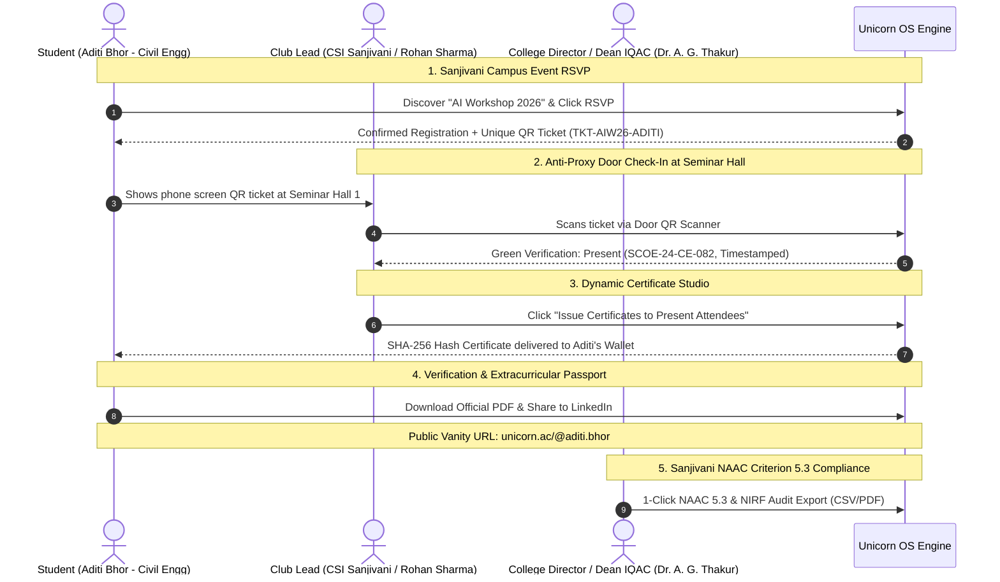

# Walkthrough: Unicorn OS MVP — Sanjivani College of Engineering Edition

> **Institution:** Sanjivani College of Engineering, Kopargaon (Autonomous • NAAC 'A' Grade • NBA Accredited)  
> **Status:** Full-Stack MVP Customization Complete in `C:\Users\Admin\.gemini\antigravity\scratch\unicorn-os`.  
> **Built with:** React 19 + TypeScript + Vite + Tailwind CSS + Lucide Icons + QRCode + JsPDF + Canvas Confetti.

---

## What We Built for Sanjivani College of Engineering

We adapted the **Unicorn — College Club OS** platform specifically for the campus ecosystem of **Sanjivani College of Engineering, Kopargaon**:



---

## Sanjivani Campus Configuration Highlights

### 1. Multi-Persona Interactive Switcher
Switch between three live campus personas from the top navigation bar:
- 🎓 **Student (`Aditi Bhor` - 2nd Year Civil Engineering, SARC & CESA Core Team)**
- ⚡ **Club Lead (`Rohan Sharma` - Lead @ CSI & Coding Club Sanjivani)**
- 🏛️ **Director & Dean IQAC (`Dr. A. G. Thakur` - Sanjivani COE)**

### 2. Active Sanjivani Clubs & Societies Included
- **CSI & Coding Club Sanjivani** (Technical workshops, hackathons, open-source bootcamps)
- **SARC (Student Alumni Relations Cell)** (Global alumni network of 20,000+ Sanjivani graduates)
- **Team Robocon & Automation Sanjivani** (National robotics competitions, autonomous rovers, drones)
- **CESA (Civil Engineering Students Association)** (Modern infrastructure, smart survey, bridge design)
- **Sanjivani Entrepreneurship Cell (E-Cell)** (Incubator grants, campus startup founders, E-Summit)

### 3. Student Experience (`/` & `/tickets` & `/wallet` & `/passport`)
- **Campus Event Feed:** Filter by Workshops, Hackathons, Webinars, and Fests with live capacity meters.
- **Luma-Style Event Detail Page:** Keynote speaker cards (Google DeepMind / Microsoft Azure), venue (*Seminar Hall 1, Sanjivani Campus*), time, faculty approval badge, and 1-click RSVP.
- **My QR Ticket Passes:** Generates scannable QR passes for each registered event.
- **Achievement Wallet:** Displays official digital credentials with certificate numbers (`SCOE-2026-ALU-0042`) and SHA-256 hashes.
- **1-Click Official Sanjivani PDF Certificate:** Vector-crisp certificate download with Sanjivani College of Engineering header, golden borders, faculty signatures, and verification QR.
- **Public Extracurricular Passport (`/@aditi.bhor`):** Shareable student extracurricular profile with verified participation history and leadership badges.

### 4. Club Command Center (`/club-overview` & `/club-scanner` & `/club-certificates` & `/club-recruitment`)
- **Door QR Attendance Scanner:**
  - Viewfinder with animated laser sweep.
  - Interactive attendee queue with 1-click test scan simulator.
  - Audio/visual feedback (green checkmark for successful check-ins, red alert for duplicate scans).
- **Dynamic Certificates Studio:** Filter by event and batch-issue verifiable certificates with 1 click to checked-in attendees.
- **Member Recruitment Kanban:** Shortlist applicants, schedule interviews, and accept members into core sub-teams.

### 5. Sanjivani Executive Administration (`/admin-overview` & `/admin-naac`)
- **Institutional Health Telemetry:** 37 Affiliated Clubs, 2,481 Students, 142 Events this year, 18,420 Participations.
- **1-Click NAAC Criterion 5.3 Exporter:** Instant export to compliant CSV/Excel format for Metric 5.1.3 and Metric 5.3.2/5.3.3.

---

## How to Run & Demo for Sanjivani

1. Navigate to the project directory:
   ```bash
   cd C:\Users\Admin\.gemini\antigravity\scratch\unicorn-os
   ```

2. Start the local development server:
   ```bash
   npm run dev
   ```

3. Open `http://localhost:5173` in your browser.
